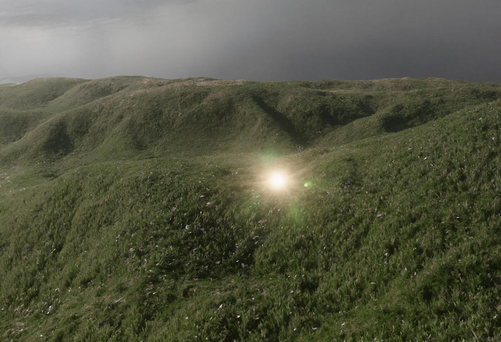

<!--
This content will be displayed at the top of the index page.
You can leave this empty if you don’t want to show any content.
-->

I will be a research scientist at [Anthrogen](https://anthrogen.com), an AI/bio startup based in SF. 

Previously, I did a math PhD at Duke where I worked in differential geometry and general relativity. Afterwards, I worked briefly in quant finance.

# Papers and Publications

- Kazaras, Demetre & Khuri, Marcus & **Lin, Michael**. (2025). The Positive Mass Theorem for Creased Initial Data. Submitted to Transactions of the AMS. [arXiv](https://arxiv.org/abs/2508.17585)

- Xu, Boyan & Tralie, Christopher & Antia, Alice & **Lin, Michael** & Perea, Jose. (2019). Twisty Takens: a geometric characterization of good observations on dense trajectories. Journal of Applied and Computational Topology. 3. [arXiv](https://arxiv.org/abs/1809.07131)

<!--  -->